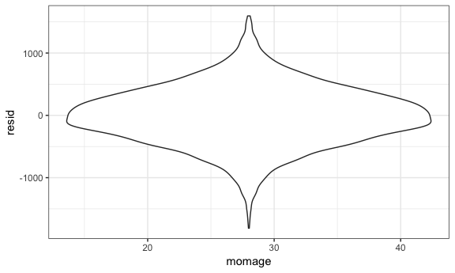

p8105\_hw6\_qg2155
================
Qiu Xia (Helen) Guan
11/20/2018

Question 1
----------

### Importing dataset

``` r
url_base = "https://raw.githubusercontent.com/washingtonpost/data-homicides/master/homicide-data.csv" 

homocide_data_raw = read_csv(url_base)
```

    ## Parsed with column specification:
    ## cols(
    ##   uid = col_character(),
    ##   reported_date = col_integer(),
    ##   victim_last = col_character(),
    ##   victim_first = col_character(),
    ##   victim_race = col_character(),
    ##   victim_age = col_character(),
    ##   victim_sex = col_character(),
    ##   city = col_character(),
    ##   state = col_character(),
    ##   lat = col_double(),
    ##   lon = col_double(),
    ##   disposition = col_character()
    ## )

``` r
homocide_data_raw
```

    ## # A tibble: 52,179 x 12
    ##    uid   reported_date victim_last victim_first victim_race victim_age
    ##    <chr>         <int> <chr>       <chr>        <chr>       <chr>     
    ##  1 Alb-…      20100504 GARCIA      JUAN         Hispanic    78        
    ##  2 Alb-…      20100216 MONTOYA     CAMERON      Hispanic    17        
    ##  3 Alb-…      20100601 SATTERFIELD VIVIANA      White       15        
    ##  4 Alb-…      20100101 MENDIOLA    CARLOS       Hispanic    32        
    ##  5 Alb-…      20100102 MULA        VIVIAN       White       72        
    ##  6 Alb-…      20100126 BOOK        GERALDINE    White       91        
    ##  7 Alb-…      20100127 MALDONADO   DAVID        Hispanic    52        
    ##  8 Alb-…      20100127 MALDONADO   CONNIE       Hispanic    52        
    ##  9 Alb-…      20100130 MARTIN-LEY… GUSTAVO      White       56        
    ## 10 Alb-…      20100210 HERRERA     ISRAEL       Hispanic    43        
    ## # ... with 52,169 more rows, and 6 more variables: victim_sex <chr>,
    ## #   city <chr>, state <chr>, lat <dbl>, lon <dbl>, disposition <chr>

This raw dataset has 52179 rows and 12 columns. The variables are uid, reported date, and victim data that includes last name, first name, race, age, and sex. Location-related variables are city, state, lat, lon. There is also a variable called disposition that describes the results of the case. For example, a homocide is a case that was closed by arrest whereas a case with sufficient evidence but an arrest was not possible (example: suspect died) is labeled as a closed case without arrest.

### Cleaning dataset

-   Create city\_state variable
-   Omit Dallas, TX; Phoenix, AZ; Kansas City, MO; Tulsa, AL
-   Modify victim\_race variable to be binary: White vs Non-White
-   Create binary variable case\_status:
    -   resolved: cases with disposition "Closed by arrest"
    -   unresolved: cases with disposition "Closed without arrest" or "Open/No arrest"

``` r
homocide_data = homocide_data_raw %>% 
  mutate(victim_race = if_else(victim_race == "White", "White", "Non-white"),
         victim_race = fct_relevel(victim_race, "White"),
         victim_age = as.numeric(victim_age),
         case_status = if_else(disposition == "Closed by arrest", "Resolved", "Unresolved"),
         case_status = fct_relevel(case_status, "Resolved")) %>%
         mutate(city_state = paste(city,state, sep = ", ")) %>% 
         filter(!city_state %in% c("Dallas, TX", "Phoenix, AZ", "Kansas City, MO", "Tulsa, AL"))
```

    ## Warning in evalq(as.numeric(victim_age), <environment>): NAs introduced by
    ## coercion

After omitting cities Dallas, Phoenix, Kansas City, and Tulsa, the cleaned dataset now has 48507 observations.

### Baltimore logistic regression

Logistic regression for odds ratio of solving homocides comparing non-white victims to white victims

``` r
baltimore_data = homocide_data %>% 
  filter(city_state == "Baltimore, MD") 

baltimore_logistic = 
  baltimore_data %>% 
  glm(case_status ~ victim_age + victim_sex + victim_race, data = ., family = binomial()) %>% 
  broom::tidy() %>% 
  mutate(OR = exp(estimate),
         ci_l = exp(estimate - std.error * 1.96),
         ci_h = exp(estimate + std.error * 1.96)) %>% 
  select(term, log_OR = estimate, OR, ci_l, ci_h, p.value) %>% 
  filter(term == "victim_raceNon-white") %>% 
  knitr::kable(digits = 3)

baltimore_logistic
```

| term                  |  log\_OR|    OR|  ci\_l|  ci\_h|  p.value|
|:----------------------|--------:|-----:|------:|------:|--------:|
| victim\_raceNon-white |     0.82|  2.27|  1.612|  3.196|        0|

### Logistic regression for all cities

Odds ratio for solving homocides comparing non-white victims to white victims in every city

Create nested dataset using city\_state

``` r
city_nest =
  nest(homocide_data, uid:case_status) 
```

-   The result is a list column for each of the 47 cities.

Create function

``` r
individual_city = function(data) {

  indi_city_glm = 
    data %>% 
    glm(case_status ~ victim_age + victim_sex + victim_race, data = ., family = binomial()) %>% 
    broom::tidy() %>% 
    mutate(OR = exp(estimate),
           ci_l = exp(estimate - std.error * 1.96),
           ci_h = exp(estimate + std.error * 1.96)) %>% 
    select(term, log_OR = estimate, OR, ci_l, ci_h, p.value) %>% 
    filter(term == "victim_raceNon-white")
}
```

``` r
city_results = 
  city_nest %>% 
  mutate(city_homocide = map(city_nest$data, individual_city)) %>% 
  unnest(city_homocide)

city_results
```

    ## # A tibble: 47 x 8
    ##    city_state   data         term        log_OR    OR  ci_l  ci_h  p.value
    ##    <chr>        <list>       <chr>        <dbl> <dbl> <dbl> <dbl>    <dbl>
    ##  1 Albuquerque… <tibble [37… victim_ra…  0.299  1.35  0.821  2.22  2.38e-1
    ##  2 Atlanta, GA  <tibble [97… victim_ra…  0.284  1.33  0.761  2.32  3.17e-1
    ##  3 Baltimore, … <tibble [2,… victim_ra…  0.820  2.27  1.61   3.20  2.68e-6
    ##  4 Baton Rouge… <tibble [42… victim_ra…  0.404  1.50  0.702  3.20  2.96e-1
    ##  5 Birmingham,… <tibble [80… victim_ra… -0.0385 0.962 0.569  1.63  8.86e-1
    ##  6 Boston, MA   <tibble [61… victim_ra…  2.17   8.73  3.59  21.2   1.72e-6
    ##  7 Buffalo, NY  <tibble [52… victim_ra…  0.942  2.56  1.40   4.70  2.31e-3
    ##  8 Charlotte, … <tibble [68… victim_ra…  0.584  1.79  1.03   3.12  3.83e-2
    ##  9 Chicago, IL  <tibble [5,… victim_ra…  0.576  1.78  1.36   2.32  2.07e-5
    ## 10 Cincinnati,… <tibble [69… victim_ra…  1.14   3.14  1.82   5.43  4.28e-5
    ## # ... with 37 more rows

Create plot for OR of each city

``` r
city_results %>% 
  mutate(city_state = fct_reorder(city_state, OR)) %>% 
  ggplot(aes(x = city_state, y = OR)) +
  geom_point() +
  geom_errorbar(aes(ymin = ci_l, ymax = ci_h)) +
  labs(
    title = "Odds Ratio for solving homocides comparing non-white victims to white victims by city",
    x = "City",
    y = "Solving homocides OR"
  ) +
  theme(axis.text.x = element_text(angle = 90, hjust = 1))
```


Boston has the highest odds of solved homocides for non-white victims.

Question 2
----------

### Importing dataset

``` r
bw_data = read_csv(file = "./birthweight.csv") %>% 
  mutate(babysex = as.factor(babysex),
         frace = as.factor(frace),
         malform = as.factor(malform),
         mrace = as.factor(mrace)) 
```

    ## Parsed with column specification:
    ## cols(
    ##   .default = col_integer(),
    ##   gaweeks = col_double(),
    ##   ppbmi = col_double(),
    ##   smoken = col_double()
    ## )

    ## See spec(...) for full column specifications.

This dataset has 4342 observations and 20 variables. Categorical variables have been switched to factors. Using the commant skimr::skim, none of the variables seem to be missing any observations.

``` r
bw_data %>% 
  skimr::skim()
```

    ## Skim summary statistics
    ##  n obs: 4342 
    ##  n variables: 20 
    ## 
    ## ── Variable type:factor ─────────────────────────────────────────────────────
    ##  variable missing complete    n n_unique                      top_counts
    ##   babysex       0     4342 4342        2         1: 2230, 2: 2112, NA: 0
    ##     frace       0     4342 4342        5 1: 2123, 2: 1911, 4: 248, 3: 46
    ##   malform       0     4342 4342        2           0: 4327, 1: 15, NA: 0
    ##     mrace       0     4342 4342        4 1: 2147, 2: 1909, 4: 243, 3: 43
    ##  ordered
    ##    FALSE
    ##    FALSE
    ##    FALSE
    ##    FALSE
    ## 
    ## ── Variable type:integer ────────────────────────────────────────────────────
    ##  variable missing complete    n      mean     sd  p0  p25    p50  p75 p100
    ##     bhead       0     4342 4342   33.65     1.62  21   33   34     35   41
    ##   blength       0     4342 4342   49.75     2.72  20   48   50     51   63
    ##       bwt       0     4342 4342 3114.4    512.15 595 2807 3132.5 3459 4791
    ##     delwt       0     4342 4342  145.57    22.21  86  131  143    157  334
    ##   fincome       0     4342 4342   44.11    25.98   0   25   35     65   96
    ##  menarche       0     4342 4342   12.51     1.48   0   12   12     13   19
    ##   mheight       0     4342 4342   63.49     2.66  48   62   63     65   77
    ##    momage       0     4342 4342   20.3      3.88  12   18   20     22   44
    ##    parity       0     4342 4342    0.0023   0.1    0    0    0      0    6
    ##   pnumlbw       0     4342 4342    0        0      0    0    0      0    0
    ##   pnumsga       0     4342 4342    0        0      0    0    0      0    0
    ##      ppwt       0     4342 4342  123.49    20.16  70  110  120    134  287
    ##    wtgain       0     4342 4342   22.08    10.94 -46   15   22     28   89
    ##      hist
    ##  ▁▁▁▁▅▇▁▁
    ##  ▁▁▁▁▁▇▁▁
    ##  ▁▁▁▃▇▇▂▁
    ##  ▁▇▅▁▁▁▁▁
    ##  ▁▂▇▂▂▂▁▃
    ##  ▁▁▁▁▂▇▁▁
    ##  ▁▁▁▅▇▂▁▁
    ##  ▂▇▅▂▁▁▁▁
    ##  ▇▁▁▁▁▁▁▁
    ##  ▁▁▁▇▁▁▁▁
    ##  ▁▁▁▇▁▁▁▁
    ##  ▁▇▆▁▁▁▁▁
    ##  ▁▁▁▇▇▁▁▁
    ## 
    ## ── Variable type:numeric ────────────────────────────────────────────────────
    ##  variable missing complete    n  mean   sd    p0   p25   p50   p75 p100
    ##   gaweeks       0     4342 4342 39.43 3.15 17.7  38.3  39.9  41.1  51.3
    ##     ppbmi       0     4342 4342 21.57 3.18 13.07 19.53 21.03 22.91 46.1
    ##    smoken       0     4342 4342  4.15 7.41  0     0     0     5    60  
    ##      hist
    ##  ▁▁▁▁▃▇▁▁
    ##  ▁▇▅▁▁▁▁▁
    ##  ▇▁▁▁▁▁▁▁

### Proposed linear model for birthweight (bwt)

mother's age at devlivery: momage, previous number of low birth weight babies: pnumlbw, family monthly income: fincome, gestational age in weeks: gaweeks

``` r
bwt_linear = lm(bwt ~ momage + pnumlbw + fincome + gaweeks, data = bw_data) 
```

Graphing the proposed linear model

``` r
bw_data %>% 
  add_residuals(bwt_linear) %>% 
  add_predictions(bwt_linear) %>% 
  ggplot(aes(x = pred, y = resid)) + geom_point()
```

    ## Warning in predict.lm(model, data): prediction from a rank-deficient fit
    ## may be misleading

    ## Warning in predict.lm(model, data): prediction from a rank-deficient fit
    ## may be misleading



Main effect and interaction models

``` r
bwt_maineff = lm(bwt ~ blength + gaweeks, data = bw_data)

bwt_interact = lm(bwt ~ bhead + blength + babysex + bhead*blength + bhead*babysex + blength*babysex + bhead*blength*babysex, data = bw_data)
```

``` r
cv_df = 
  crossv_mc(bw_data, 100) 
```

``` r
cv_df = 
  cv_df %>% 
  mutate(bwt_linear = map(train, ~lm(bwt ~ blength + gaweeks, data = .x)),
         bwt_maineff = map(train, ~lm(bwt ~ blength + gaweeks, data = .x)),
         bwt_interact = map(train, ~lm(bwt ~ bhead + blength + babysex + bhead*blength + bhead*babysex + blength*babysex + bhead*blength*babysex, data = .x))) %>% 
  mutate(rmse_linear = map2_dbl(bwt_linear, test, ~rmse(model = .x, data = .y)),
         rmse_maineff = map2_dbl(bwt_maineff, test, ~rmse(model = .x, data = .y)),
         rmse_interact = map2_dbl(bwt_interact, test, ~rmse(model = .x, data = .y)))
```

Plotting the rmse of each model

``` r
cv_df %>% 
  select(starts_with("rmse")) %>% 
  gather(key = model, value = rmse) %>%  
  mutate(model = str_replace(model, "rmse_", ""),
         model = fct_inorder(model)) %>% 
  ggplot(aes(x = model, y = rmse)) + geom_violin()
```


The interaction model has the lowest rmse (287.4692) and therefore it is the best model.

``` r
rmse(bwt_linear, bw_data)
```

    ## Warning in predict.lm(model, data): prediction from a rank-deficient fit
    ## may be misleading

    ## [1] 462.1494

``` r
rmse(bwt_maineff, bw_data)
```

    ## [1] 333.1023

``` r
rmse(bwt_interact, bw_data)
```

    ## [1] 287.4692
